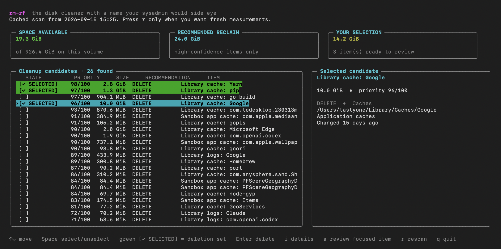
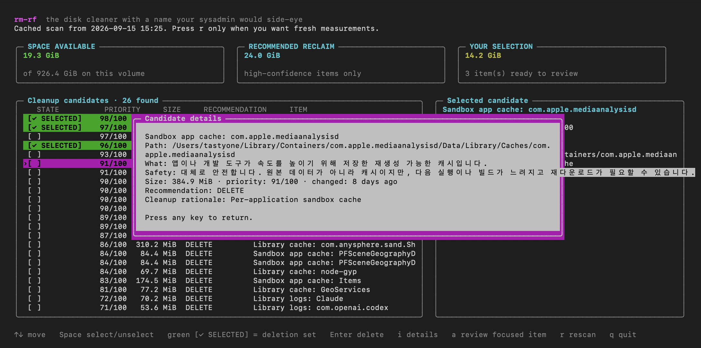

# rm-rf

A playful, conservative disk cleaner for macOS and Ubuntu.

```sh
./rm-rf
```

Run it, pick items with `Space`, then press `Enter` to delete them.

It only scans known cleanup areas. Deletion always requires typing `DELETE`.

## At a glance

See free space, recommended reclaim, selected items, and each candidate's priority in one terminal screen.



Press `i` for the item's path, what it is, why it is safe or risky to remove, and the cleanup rationale.



## Advanced

- Scan results expire after **24 hours** and refresh automatically. Use `--cache-ttl-hours 6` to change it, or `0` to always rescan.
- Press `r` to rescan now and `i` for item details.
- Claude CLI: `rm-rf` uses your signed-in `claude` CLI for automatic reviews during a new scan, or when you press `a` on the focused item. `i` only shows saved details and the latest Claude verdict; it does not make a Claude request.
